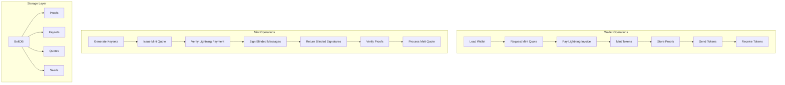

# Gonuts Library Overview

## Introduction

Gonuts is a comprehensive Go implementation of the Cashu protocol, providing both wallet and mint functionality for Bitcoin ecash operations. The library enables privacy-preserving, Lightning Network-compatible payments using Chaumian blinded signatures.

## Architecture

The library is organized into several key packages:

```
gonuts/
├── cashu/          # Core protocol types and utilities
├── crypto/         # Cryptographic operations
├── wallet/         # Client-side wallet operations
├── mint/           # Server-side mint operations
├── cmd/            # Command-line tools
└── docs/           # Documentation
```

### Core Components

#### 1. Cashu Package (`cashu/`)
- **Purpose**: Core protocol implementation
- **Key Types**: `Proof`, `Token`, `BlindedMessage`, `BlindedSignature`
- **Features**: Token serialization, amount splitting, DLEQ proofs
- **NUT Specifications**: Implements NUT-00 through NUT-20

#### 2. Crypto Package (`crypto/`)
- **Purpose**: Cryptographic primitives and keyset management
- **Key Types**: `MintKeyset`, `WalletKeyset`, `KeyPair`
- **Features**: Key derivation, signature generation, DLEQ proofs
- **Security**: Uses secp256k1 curve, deterministic key generation

#### 3. Wallet Package (`wallet/`)
- **Purpose**: Client-side ecash operations
- **Key Types**: `Wallet`, `Config`
- **Features**: Token creation, proof management, multi-mint support
- **Storage**: BoltDB-based persistence

#### 4. Mint Package (`mint/`)
- **Purpose**: Server-side mint operations
- **Key Types**: `Mint`, `Config`
- **Features**: Token issuance, proof verification, Lightning integration
- **Backends**: LND, CLN, and fake backends for testing

## Data Flow



## Key Features

### Multi-Mint Support
- Wallets can trust and interact with multiple mints
- Automatic keyset management per mint
- Cross-mint token transfers

### Offline Capabilities
- Wallet initialization with cached keysets
- Offline token creation from existing proofs
- Graceful degradation when network unavailable

### Lightning Integration
- Mint quotes for receiving payments
- Melt quotes for sending payments
- Support for multiple Lightning backends

### Privacy Features
- Blinded signatures for unlinkability
- P2PK for receiver privacy
- HTLC for conditional payments

## Protocol Flow

### Minting (Receiving)
1. **Request Quote**: Wallet requests mint quote from mint
2. **Pay Invoice**: User pays Lightning invoice
3. **Create Blinded Messages**: Wallet creates blinded messages for desired amounts
4. **Sign Messages**: Mint signs blinded messages after payment verification
5. **Unblind Signatures**: Wallet unblinds signatures to create proofs
6. **Store Proofs**: Wallet stores proofs in local database

### Sending
1. **Select Proofs**: Wallet selects proofs for desired amount
2. **Create Token**: Wallet creates cashu token containing proofs
3. **Mark Pending**: Proofs marked as pending to prevent double-spending
4. **Transfer Token**: Token transferred to recipient (QR code, text, etc.)

### Receiving
1. **Decode Token**: Recipient decodes received token
2. **Verify Proofs**: Wallet verifies DLEQ proofs if present
3. **Swap Tokens**: Proofs swapped for new ones from trusted mint
4. **Store New Proofs**: New proofs stored in wallet database

### Melting (Spending)
1. **Request Quote**: Wallet requests melt quote for Lightning invoice
2. **Select Proofs**: Wallet selects proofs to cover invoice + fees
3. **Submit Proofs**: Proofs submitted to mint for payment
4. **Pay Invoice**: Mint pays Lightning invoice
5. **Return Change**: Mint returns change as new proofs if applicable

## Security Model

### Trust Assumptions
- Users must trust mints not to double-spend tokens
- Mints cannot see token amounts due to blinding
- Mints cannot link payments due to unlinkability

### Key Management
- Deterministic key derivation from master seed
- Separate keysets for different denominations
- Regular keyset rotation for security

### Proof Verification
- DLEQ proofs ensure mint cannot forge signatures
- Keyset validation prevents malicious keysets
- Duplicate proof detection prevents double-spending

## Performance Considerations

### Batch Operations
- Multiple proofs can be processed in single requests
- Efficient amount splitting for optimal proof sizes
- Background keyset updates to minimize blocking

### Storage Optimization
- Inactive keyset keys not stored in memory
- Efficient proof indexing by keyset ID
- Automatic database cleanup of spent proofs

### Network Efficiency
- Minimal network requests for offline operations
- Intelligent keyset caching and validation
- Connection pooling for multiple mint interactions

## Error Handling

### Network Errors
- Automatic retry with exponential backoff
- Graceful degradation to offline mode
- Clear error messages for network issues

### Protocol Errors
- Validation of all incoming data
- Proper handling of malformed tokens
- Recovery from partial operation failures

### Storage Errors
- Database transaction safety
- Backup and recovery procedures
- Corruption detection and repair

## Extensibility

### Custom Storage Backends
- Interface-based storage layer
- Easy addition of new database backends
- Migration tools for data portability

### Lightning Backend Support
- Pluggable Lightning implementations
- Support for LND, CLN, and custom backends
- Automatic backend capability detection

### NUT Specification Support
- Modular NUT implementation
- Easy addition of new specifications
- Backward compatibility maintenance

## Testing

### Unit Tests
- Comprehensive test coverage for all components
- Mock implementations for external dependencies
- Property-based testing for critical functions

### Integration Tests
- Full wallet-mint interaction testing
- Multi-mint scenario testing
- Network failure simulation

### Performance Tests
- Benchmarking for critical operations
- Memory usage profiling
- Concurrent operation testing

## Development Tools

### Command Line Tools
- `nutw`: Wallet CLI for user operations
- `mint`: Mint server for testing and development
- `mint-cli`: Mint management CLI

### Examples
- Basic wallet operations
- Mint server setup
- Integration examples

### Debug Tools
- Verbose logging options
- Transaction tracing
- State inspection utilities